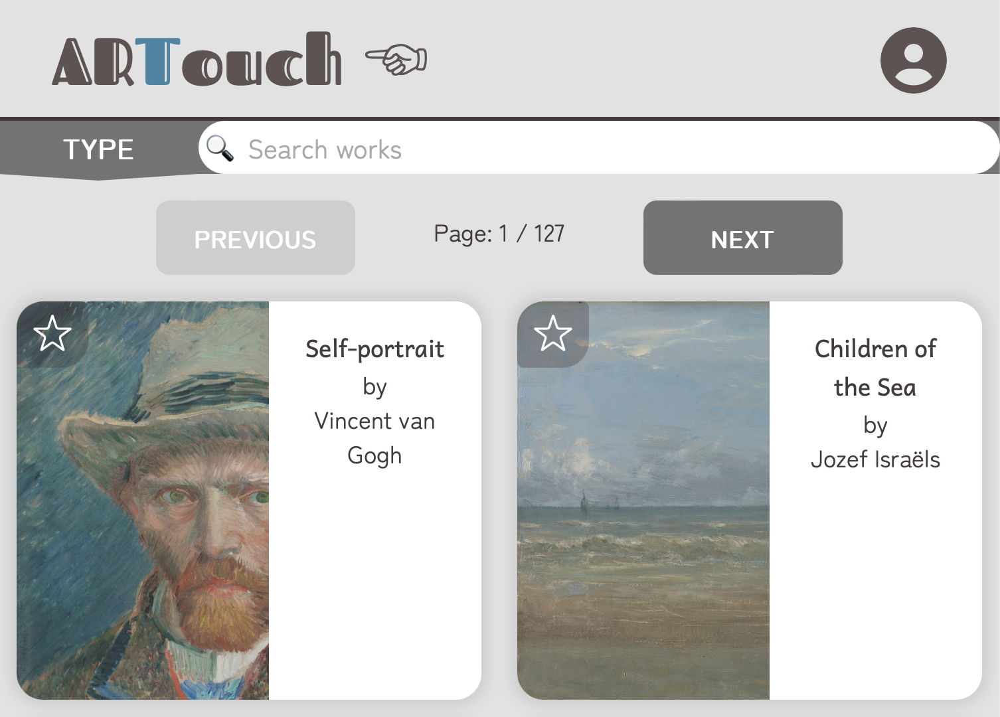
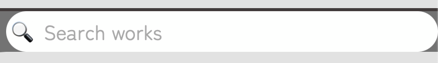
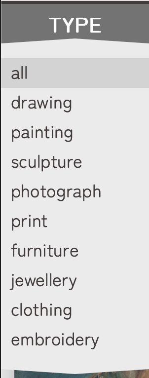
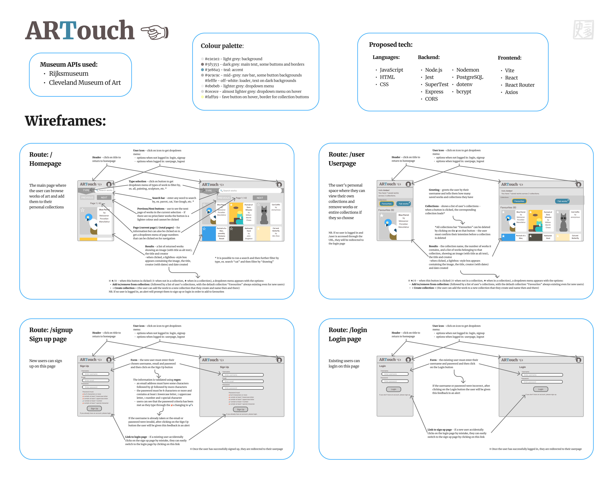
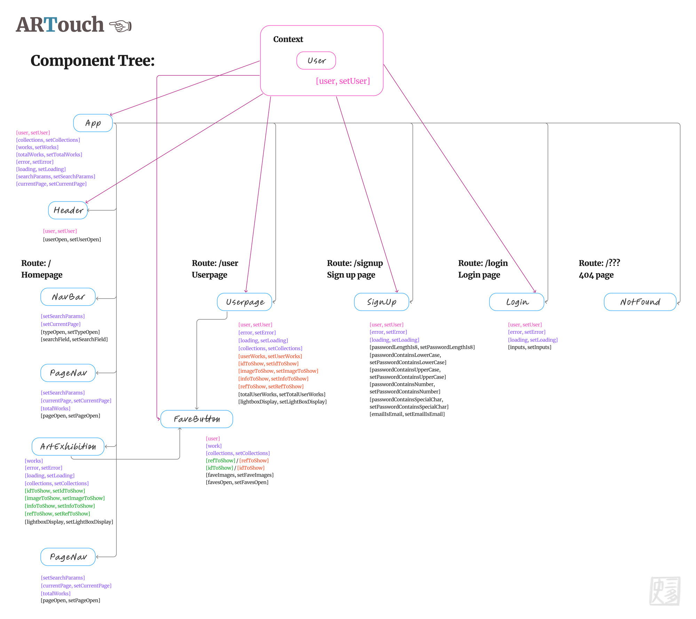

# ARTouch ☜ ReadMe - Front-end

## What is ARTouch?

ARTouch is a web app designed to make finding your new favourite artworks a fun - and painless! - experience.

### Deployed versions

- You can access the deployed **front-end** version [here](https://pipmurphy.com/artouch).
- You can access the deployed **back-end** version [here](https://artouch.onrender.com/api).

### GitHub repositories

- This is the **front-end** repository.
- You can find the **back-end** repository [here](https://github.com/santashifinn/artouch-be).

## Key features

### In short:

 - **ARTouch** is a web app with a responsive UI that intuitively guides users to search, view, and create curated exhibitions of artworks from the [**Rijksmuseum**](https://www.rijksmuseum.nl/en) in Amsterdam and the [**Cleveland Museum of Art**](https://www.clevelandart.org/) in Ohio

 ### In full:

 - Users can **browse artworks**, from a list view, with **"Previous" and "Next" page navigation options** to prevent loading of too many items at once
 - Users can **search and filter artworks** to make it easier to navigate through larger lists of items
 - Users can then **view images and essential details** about each artwork **individually** using a lightbox style display
 - Users can **save their favourite artworks**, adding or removing pieces as they see fit, and view them at their leisure on their userpage

## How to use

### Main page

#### Search options

You can enter any word or term you like into the **search bar** and press **enter** to search.

You can also **filter** the results further by these 10 **types** of work:
- all (every type of work is included)
- drawing
- painting
- sculpture
- photograph
- print
- furniture
- jewellery
- clothing
- embroidery

## Tech used

This project was written in JavaScript, HTML and CSS and used:

### Frontend:

- Vite
- React
- React Router
- Axios
- dotenv
- eslint

### APIs used

- Rijksmuseum
- Cleveland Museum of Art

### UI considerations:

 -  **Accessibility for users with disabilities** is taken into account, eg. alternative text, good contrasts for readability
 - **Alerts**, **loading states** and **error messages** are provided so that the user can clearly understand problems - or lack of them!

## Planning

### Wireframes

### Component Tree

## Run this project locally

### How to clone

- If you'd like to try running this repository on your local machine, you can clone it by entering the following command in your terminal: `git clone https://github.com/santashifinn/artouch-fe`.
- Then navigate into the folder using the command `cd artouch-fe`.
- After that please install:

- **Node.js** - v22.8.0 [install using the command `npm install`]

### Required dependencies - minimum versions needed to run project

### Frontend:

- **Node.js** - v22.8.0
- **Vite** - v6.3.5
- **React** - v.19.1.0
- **React Router** - v.7.6.0
- **Axios** - v.1.9.0
- **dotenv** - v.16.5.0
- **eslint** - v. 9.25.0

\*These will all be installed through the command `npm install` and don't need to be installed separately.

### Requirements to view Rijksmuseum works

1. Please sign up for a **Rijksmuseum** account [here](https://www.rijksmuseum.nl/en/collection).

2. Find your API key, which is located in the advanced settings of your Rijksmuseum account.

3. Create a file called **.env** at the top level of the local directory.

4. Add the text `VITE_RIJKS_API_KEY=[YOUR-KEY-HERE]` to the .env file, replacing `[YOUR-KEY-HERE]` with your own Rijksmuseum API key.

※ The Cleveland Museum of Art API does not require a key for access

## Thank-yous

Thank you firstly to Northcoders/Launchpad for requesting this project, to you for taking the time to check it out, and to my cat Amber for her unwavering support and snuggles while bringing ARTouch to life.
