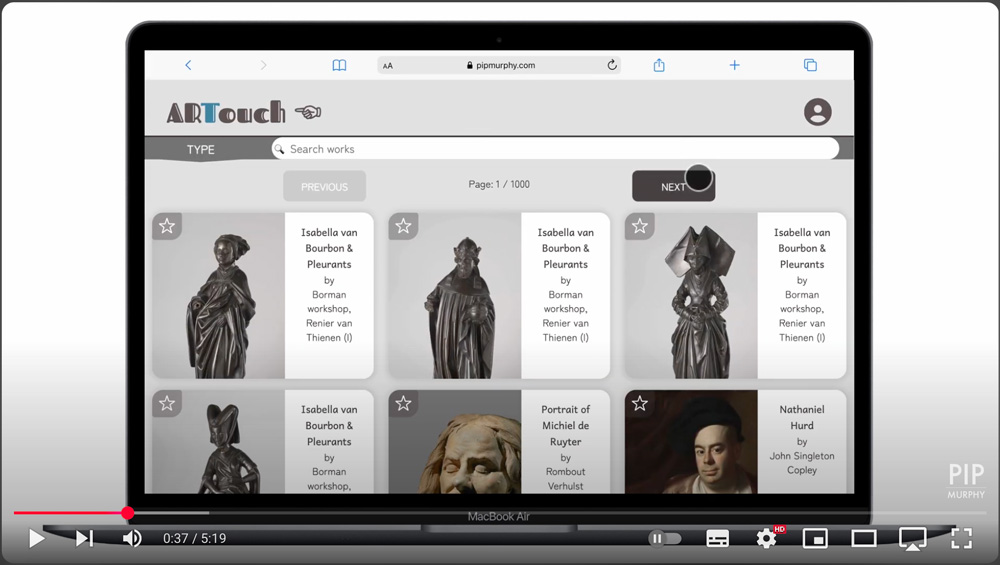
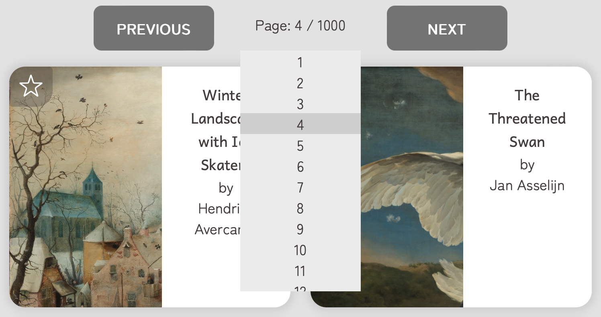
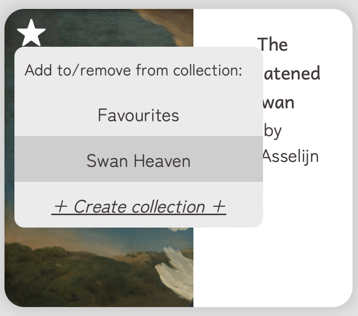
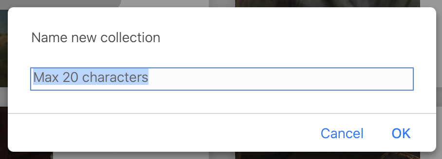
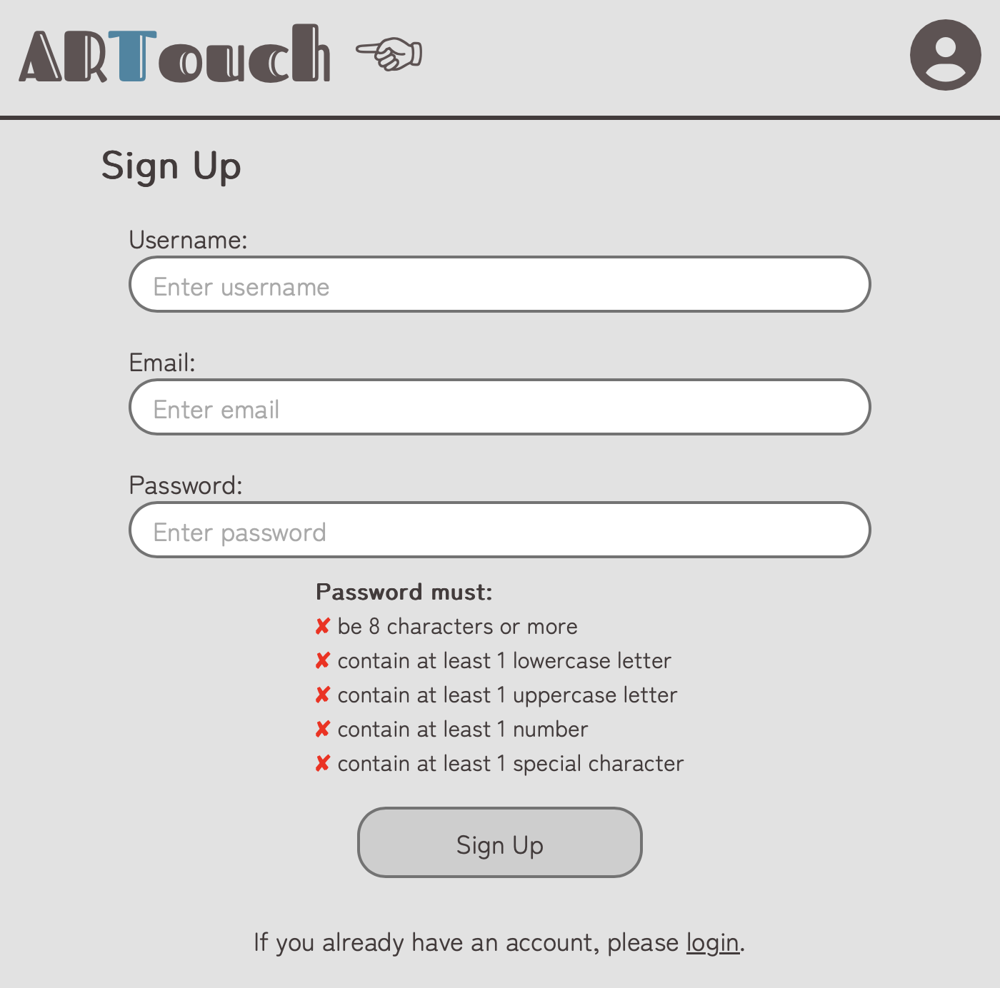
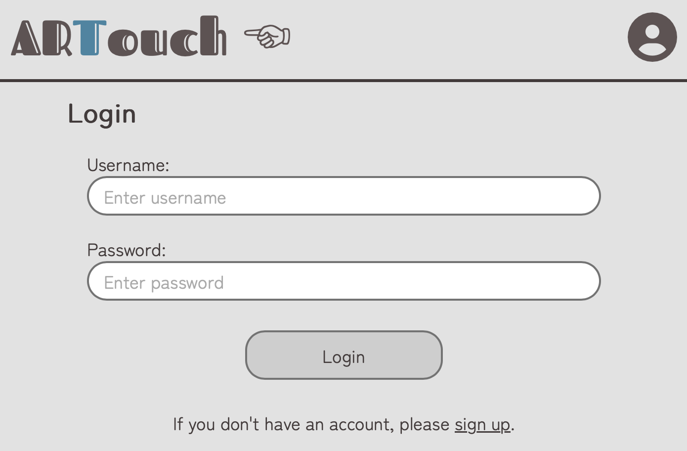

# ARTouch ☜ ReadMe - Front-end

## What is ARTouch?

ARTouch is a web app designed to make finding your new favourite artworks a fun - and painless! - experience.

### Deployed versions

- You can access the deployed **front-end** version [here](https://pipmurphy.com/artouch).
- You can access the deployed **back-end** version [here](https://artouch.onrender.com/api).

### GitHub repositories

- This is the **front-end** repository.
- You can find the **back-end** repository [here](https://github.com/santashifinn/artouch-be).

## Key features

### In short:

 - **ARTouch** is a web app with a responsive UI that intuitively guides users to search, view, and create curated exhibitions of artworks from the [**Rijksmuseum**](https://www.rijksmuseum.nl/en) in Amsterdam and the [**Cleveland Museum of Art**](https://www.clevelandart.org/) in Ohio

 ### In full:

 - Users can **browse artworks**, from a list view, with **"Previous" and "Next" page navigation options** to prevent loading of too many items at once
 - Users can **search and filter artworks** to make it easier to navigate through larger lists of items
 - Users can then **view images and essential details** about each artwork **individually** using a lightbox style display
 - Users can **save their favourite artworks**, adding or removing pieces as they see fit, and view them at their leisure on their userpage

## How to use

### Video Guide

### Main page

#### Navigation

Depending on the number of results available, there will be up to 10 works displayed per page, 5 from the **Rijksmuseum** and 5 from the **Cleveland Museum of Art**. If no more works are available from one museum, the deficit will be made up with works from the other museum.

You can navigate between pages using the **"PREVIOUS"** and **"NEXT**" buttons or by clicking on the page numbers. Clicking on the **total page number** will take you to the last page, while clicking on the **current page number** will bring up a drop-down menu where you can select your chosen page.

NB. The maximum number of pages is capped at 1000 (10,000 works) in order to limit strain on the museum APIs.

#### Search options

You can enter any word or term you like into the **search bar** and press **enter** to search.

You can also **filter** the results further by these 10 **types** of work:
- all (every type of work is included)
- drawing
- painting
- sculpture
- photograph
- print
- furniture
- jewellery
- clothing
- embroidery

#### Expanding Images

If you **click on an image or its text**, a **larger version** of the image will be displayed with **more detailed information**.

#### Adding to Collections

If you are logged in and **click on the star** in the top left corner of the image, you can **add the work to or remove it from one of your existing personal collections**, ex. "Favourites", or **create a new collection** to add it to.

If you choose to create a new collection, you can enter any name up to 20 characters in length.

### Sign Up / Login pages

#### Sign Up

To **sign up** you need to enter a **username, email and password**.

The password must:
- be 8 characters or more
- contain at least 1 lowercase letter
- contain at least 1 uppercase letter
- contain at least 1 number
- contain at least 1 special character

Once you meet one of the password criteria, its ✘ will become a ✔.

After successfully signing up, you will be redirected to your Userpage.

#### Login

To **log in** you need to enter a **valid username and password**. After successfully logging in, you will be redirected to your Userpage.

### Userpage

When logged in, you can view your userpage and see the **total number of works** you have saved and **how many collections** you have.

You will see a **list of your collections** and can click on them to switch between them.

If you wish, you can **delete** a collection by clicking on the **✘** in the top right corner of the collection name and confirming your choice in the alert box.

NB. The **"Favourites"** collection itself cannot be deleted as it is the default collection for all users, but you can still add or remove works from it as you choose.

## Tech used

This project was written in **JavaScript**, **HTML** and **CSS** and used:

### Frontend:

- Vite
- React
- React Router
- Axios
- dotenv
- eslint

### APIs used

- Rijksmuseum
- Cleveland Museum of Art

### UI considerations:

 -  **Accessibility for users with disabilities** is taken into account, eg. alternative text, good contrasts for readability
 - **Alerts**, **loading states** and **error messages** are provided so that the user can clearly understand problems - or lack of them!

## Planning

### Wireframes

### Component Tree

## Run this project locally

### How to clone

- If you'd like to try running this repository on your local machine, you can clone it by entering the following command in your terminal: `git clone https://github.com/santashifinn/artouch-fe`.
- Then navigate into the folder using the command `cd artouch-fe`.
- After that please install:

- **Node.js** - v22.8.0 [install using the command `npm install`]

### Required dependencies - minimum versions needed to run project

### Frontend:

- **Node.js** - v22.8.0
- **Vite** - v6.3.5
- **React** - v.19.1.0
- **React Router** - v.7.6.0
- **Axios** - v.1.9.0
- **dotenv** - v.16.5.0
- **eslint** - v. 9.25.0

\*These will all be installed through the command `npm install` and don't need to be installed separately.

### Requirements to view Rijksmuseum works

1. Please sign up for a **Rijksmuseum** account [here](https://www.rijksmuseum.nl/en/collection).

2. Find your API key, which is located in the advanced settings of your Rijksmuseum account.

3. Create a file called **.env** at the top level of the local directory.

4. Add the text `VITE_RIJKS_API_KEY=[YOUR-KEY-HERE]` to the .env file, replacing `[YOUR-KEY-HERE]` with your own Rijksmuseum API key.

※ The Cleveland Museum of Art API does not require a key for access

## Thank-yous

Thank you firstly to **Northcoders/Launchpad** for requesting this project, to **you** for taking the time to check it out, and to my cat **Amber** for her unwavering support and snuggles while bringing **ARTouch** to life.
